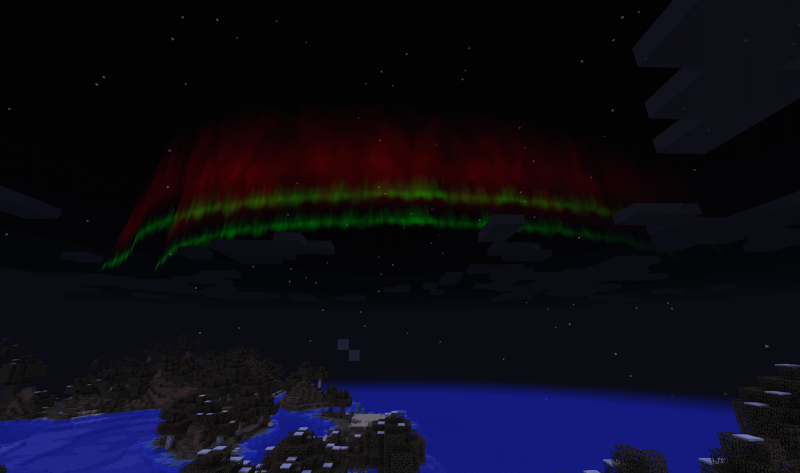

Aurora Borealis
===============

Auroras are special nighttime features that display north of the player when they are standing in
a biome that is considered a polar type biome such as Taiga and Ice Plains.  These effects are
purely visual and do not affect game play mechanics.

When auroras can occur they will start fading in about sunset, and will fade out around sunrise.
The coloring, size, and number of bands will differ every night.  The seed for the random generator
is based on the Minecraft day.

The shader version of the aurora can be disabled if your computer system struggles to keep up
with it.  The options can be found under Aurora Options in Dynamic Surroundings configuration page.

See `this page <http://ffden-2.phys.uaf.edu/211.fall2000.web.projects/Christina%20Shaw/AuroraColors.html>`__ for more information on auroras.

..	note::

	Aurora rendering does not play well with a lot of shader packs.  The main reason is that these
	shader packs will step on whatever rendering Dynamic Surroundings is doing.  I can't help that.
	This is why a lot of mod authors with mods that do fancy graphics do not support shader packs.