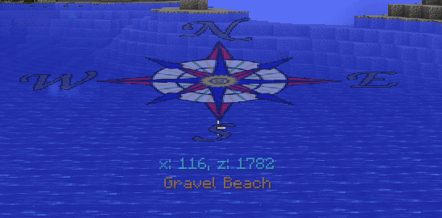

Compass HUD
===========

When a player holds a Minecraft compass a HUD will be displayed around the crosshairs.  This HUD will
give location information as well as player facing.  The compass can be held in either hand.

There are 7 styles of compass available: 0-3 variations of the classic "bar" style compass, and 4-6
are compass rose style.  The one pictured above is style 4.

Options for configuring the compass HUD are available in the configuration GUI.

Notes:

- Does not require server side support to function.
- Compass can be held in either hand.  If held in the offhand it will leave the mainhand available for tools or weapons.
- Feature can be turned off.