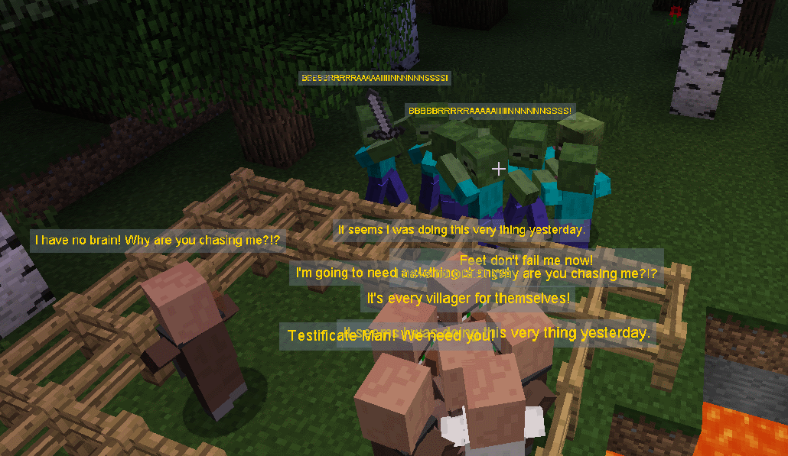

Entity Chat
===========

To liven things up a bit Dynamic Surroundings will have various entities "say" things by popping up
a speech bubble above their head.  Main focus is villagers, though Zombies, Skeletons, Witches and
Squids sometimes have something to say.

Villager chat is based on whether they are fleeing zombies, or are doing their normal thing around
the village.

This feature is turned off by default.  It can be easily be turned on under the Speech Bubble Options.
This feature is 100% client side so no server side support is required.

Currently there is no external way to configure additional messages.  This may change in the future.
