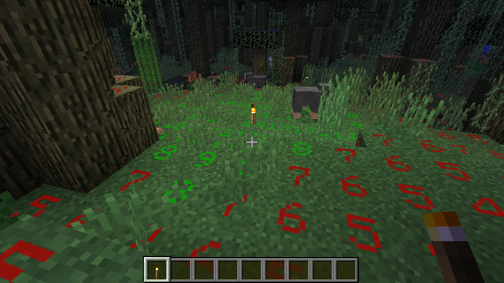

..	role:: sectiontitle

Light Level HUD
===============

The Light Level HUD provides information related to block light levels.  This information can be used
to determine potential mob spawn locations as well as placing of light sources.  The HUD can be turned
on/off using the F7 key (by default).

:sectiontitle:`Controls`

- F7 toggles HUD on/off
- CTRL+F7 toggles between block light and block+skylight values
- SHIFT+F7 toggles display of light levels on "safe" blocks (mobs don't spawn on safe blocks)

:sectiontitle:`Styles`

The HUD as two different display styles:

- 0: The light level value renders upright and toward the player
- 1: The light level is "printed" on top of the block oriented so the player can read them normally

:sectiontitle:`Color Code`

- Green - block that can normally spawn mobs but the light level is sufficient to block
- Yellow - light level is currently high enough to prevent mob spawn, but when the sun sets or light is diminished mobs can spawn
- Red - block can spawn mobs
- Blue - the block is a "safe" block meaning mobs cannot spawn (slabs, fences, glass, etc.)

:sectiontitle:`Config Options`

Additional configuration options can be found under "Light Level HUD Options" in the configuration
GUI:

- Block Range: How far out the HUD will analyze block light levels.  The greater the range the more tick time it will take to analyze.
- Mob Spawn Light Threshold: light level where mobs can spawn.  Can be adjusted based on 3rd party mod configuration.
- Display Mode: determines how the light level is calculated; 0 - block light only, 1 - block + skylight
- Render Mode: 0 - light level number upright and facing player; 1 - light level rendered on top of block oriented normally toward player
- Hide Safe Blocks: suppress display of light levels on safe blocks when enabled
- Indicate caution: color light levels yellow if the current light level is > than mob spawn light threshold, but will drop below that threshold at night.
- Color Set: 0 - use bright color set for numbers; 1 - use dark color set for numbers.
