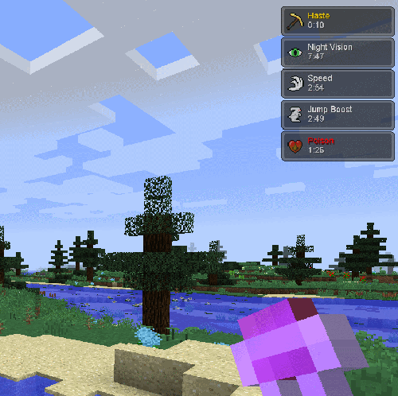

Potion HUD
==========

By default Dynamic Surroundings will replace Minecraft's potion HUD.  If this behavior is disabled
operation will revert back to Minecraft's implementation.

Features of Dynamic Surroundings potion HUD:

- Potion effect icons are larger and have the potion name and remaining duration listed.
- The color of the name indicates the effect it has.  White is a normal beneficial effect, gold is an ambient effect (such as effects from beacons), and negative effects are colored red.
- Display size of the HUD can be scaled by changing a configuration setting.
- By default the HUD is located in the upper right corner to mirror Minecraft behavior.  The location can be changed to the upper left corner by changing configuration settings.
