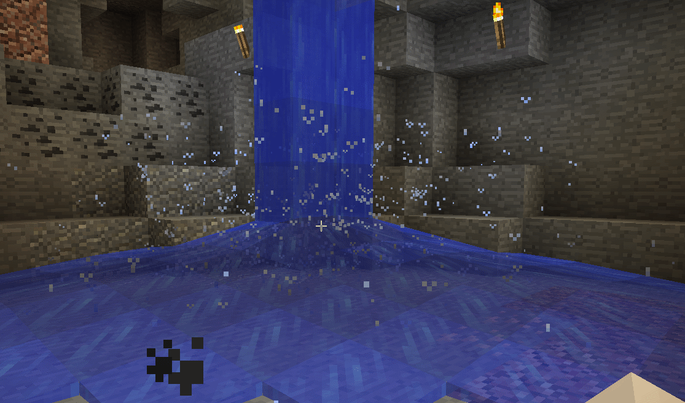

Water Splash
============

Waterfall splashing occurs when there is flowing water.  It could be as simple as dumping a bucket
of water on the ground, or having it fall from a height.  The rules are a bit complicated, but the
simplest explanation is that if there is flowing water on a solid block splashes can occur.

The amount and scope of the spray is based on how many blocks of water are in the water column above
the solid block.  The more water there is, the bigger the splash.

Keep in mind that the default range for these types of effects is 24 blocks, the closer the better.
This range can be tweaked in the player settings to a larger distance.  Just be aware that increasing
the particle range will cause Dynamic Surroundings to do more work per tick.

This effect can be intensive in terms of particles and sound.
