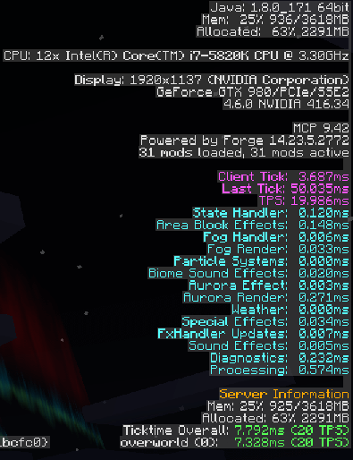

..	role:: underlined
..	role:: sectiontitle
..	role:: question

Performance
===========
I have spent quite a bit of time tuning and tweaking Dynamic Surroundings to have as small an impact
on client side processing as possible.  Because of the nature of what the mod does (particles, sound,
etc.) players automatically assume it is some sort of performance hog.  Though I cannot say that
the mod will be a speed demon in all situations I think it will perform well for the majority of
players that use something other than a potato for a computer.

Without a doubt the most intensive processing occurs when rendering the aurora shader.  It is a complex
graphical beast and does require a system that has some CPU and GPU power to it.  If for some reason
your system does not perform well rendering the shader you can configure Dynamic Surroundings to use
the classic aurora render mechanism, or you can turn the feature entirely off.

The second most impactful feature is the waterfall splash effect.  And it is more than likely due to
sound lag.  For very large falls many point sources of sound are created to give the sensory feel of
being near a waterfall.  Large quantities of sounds down in the sound engine could cause the engine to
stutter a bit, and thus cause Minecraft to stutter during sound tick processing.  If you encounter
large falls and it causes problems you can disable the watersplash effect.

Dynamic Surroundings does take timings the various processes that it performs during a client tick.
You can see the information that it collects by turning on Dynamic Surrounding debug logging, and
hitting F3 to see the debug display.  Here is picture of a what I see on my system running a debug
build after about 4 minutes since client start:

So what does all this stuff mean?

:sectiontitle:`Client Tick`

This is a time measurement of how long a client tick takes based on the when the Dynamic Surroundings tick
handler get's called.  This serves as a pretty good estimate as to how well the client is performing as it
relates to a client tick.  The timing values are color coded in magenta.

- :underlined:`Client Tick`  Estimate of how long it takes to tick the client.
- :underlined:`LastTick`  The amount of time since the last client tick was invoked.
- :underlined:`TPS` The calculated TPS based on the timing information that has been captured.

:sectiontitle:`Measures`

These timing measures are for each of the major areas of operation that occur during a client tick.  There
are two types of measures.  The ones colored in aqua are actually executed by Dynamic Surroundings during
a client tick event.  The ones colored in gray are considered "out of band", meaning that these operations
occur outside the normal client tick, but do incur processing overhead because of Dynamic Surroundings
features.

- :underlined:`State Handler`  Dynamic Surroundings gathers up a lot of state information about the player and the environment and stores it in one place.  This is to reduce redundant calls, especially if they are expensive.
- :underlined:`Area Block Effects`  This is where several area scanners examine the environment around the player to do block effects like frog croaks, bees, bubbles in water, fire jets, etc.
- :underlined:`Fog Handler`  Dynamic Surroundings calculates a variety of different fog equations, such as weather, morning fog, etc.  These calculations occur per tick.
- :underlined:`Fog Rendering`  This is the accumulated time between ticks taken by fog color and density routines when rendering.  Since it is during the render pass it is out of band.
- :underlined:`Particle Systems`  Time taken processing Dynamic Surroundings particle systems, such as the waterfall splash/sound effect.
- :underlined:`Biome Sound Effects`  Time taken examining the area around the player and figuring out the biome sounds to play, as well as other effects like player health heartbeat and biome spot sounds (birds, insects, etc.)
- :underlined:`Aurora Effect`  Includes things like spawning and tracking aurora against the diurnal cycle.
- :underlined:`Aurora Render`  Similar to Fog Rendering, but applies to the aurora visual effect.
- :underlined:`Weather`  At the moment this only includes lightning effects outside Minecraft's strike processing.
- :underlined:`Special Effects`  Minimal handler that processes data from Entity Effect Updates.
- :underlined:`Entity Effect Updates`  This includes all special entity effects, such as footsteps, frost breath, entity chat, etc.  This includes players.  Processing occurs during the client side LivingUpdateEvent thus is considered out of band.
- :underlined:`Sound Effects`  Responsible for maintaining sound emitters, handle sound blocking, culling, sound replacement, and mood processing.
- :underlined:`Diagnostics`  Responsible for generating all the diagnostic information in the debug HUD.  It's overhead when the F3 debug screen is active.
- :underlined:`Processing`  This is the overall time taken to process all the in band handlers.  Can be considered an aggregate of all those operations.

:sectiontitle:`Impact`

This calculation is an estimate of how much Dynamic Surroundings impacts a client tick.  The number is
generated by simply adding the Processing time value and all the out of band timers, and then subtracting
the overhead of Diagnostic collection.  This value could be considered the time it takes Dynamic
Surroundings to do it's thing when the debug HUD is hidden.

:sectiontitle:`Server Information`

If enabled, and if Dynamic Surroundings is installed on the server, TPS information that Forge collects
will be forwarded to clients.

..	note::

	The an out of band render time is the amount of aggregate time spent rendering the particular effect
	and is not part of the normal tick.  If you want to figure out the impact for a single render pass
	take the timing value and divide it by the FPS.
	
..	note::

	These timing values are exponential moving averages over the preceeding 100 ticks (5 seconds).  This
	will smooth out the highs and lows giving a better impression as to the impact on the system.  An
	internet search on EMAs can give the math/theory behind them.
   
..	note::

	Be careful about *when* you try and interpret the timing information.  When Java code is first run it
	is interpreted.  The JVM will at some point compile the code into native CPU instructions and will be
	much faster.  If you were to start the Minecraft client fresh, load up a world, and then hit F3 the
	timing values would seem large.  Sitting their watching you will see the values stabilize, and then
	at some point will drop futher once the code has been compiled.  You can find more information on
	JIT compilation on Wikipedia_.
	
For clarity here are some additional points to consider:

- I was standing in one place.  Some of the processing has stabilized (most notably the cuboid scanner responsible for effects such as waterfalls).  If I were to move the amount of time processing would go up because the new blocks that enter within the special effect range would need to be scanned.
- The JVM was not entirely warmed up.  The JIT process hasn't really taken full effect.  There is a point at which JIT kicks in and you can see the measurements drop.
- This is v3.5 of Dynamic Surroundings.  It has additional performance improvements to reduce lookups and improve caching over and beyond what previous versions had.

If you suspect that Dynamic Surroundings is having a performance issue enable debug tracing
and hit F3.  I would like to see the timing results and any information you have related to the issue
you are experiencing.

-----

If you are stuck with a potato, or even a squash, for a computer there are several things you can
tweak to try and improve the situation.

:question:`Disable the shader version of Auroras`

This really only applies if you hang around areas where they render.  As mentioned above they can be
rather intensive in terms of processing *when rendering*.

:question:`Disable water suspend particle effect`

Suspend particles are those little black square like particles that generate in the water.  If you
spend time out by large bodies of water this can reduce your particle load quite a bit.

:question:`Reduce the Special Effect rendering range`

By default the special effects rendering of Dynamic Surroundings will be out to 24 blocks (about
45x45x45 blocks centered on the player).  Lowering this value will reduce the amount of blocks
that Dynamic Surroundings will have to scan as well as reduce the number of entity effects that
have to be handled.  Conversely, increasing this value will increase workload so be careful.

:question:`Change Minecraft's Particle Setting`

Changing the particle setting to decreased or minimum will reduce the number of particles being
rendered.  This change could have other side effects, such as a change in the sound sense with
falling rain.  (Minecraft sound generation for rain is tied to particle generation - go figure.)

:question:`Increase the Waterfall Cutoff`

If you stay around large waterfalls you could experience sound lag.  Increasing the cutoff value
will reduce the overall amount of sounds that are played by the waterfall effects.  By default
the value is 0 meaning that all sound points will play.  Increasing to 1 or 2 can significantly
cut back on the number of sound points.

.. _Wikipedia: https://en.wikipedia.org/wiki/Just-in-time_compilation