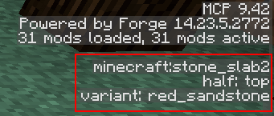
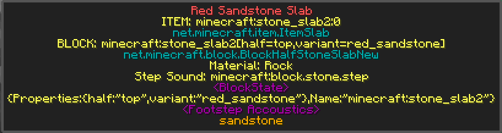

Tutorial: BlockState Specification
==================================
Unlike prior versions of Dynamic Surroundings, the 3.5+ versions do not make use of block metadata
when configuring blocks.  The configuration and parsing system has been modified to make use of
blockstate properties.

A good example comes from the configuration Json that Dynamic Surroundings uses to configure
vanilla monster egg (Silverfish) blocks::

	"minecraft:monster_egg": "brickstone",
	"minecraft:monster_egg[variant=stone]": "stone",
	"minecraft:monster_egg[variant=cobblestone]": "stone",

The above definitions do several things:

- ``minecraft:monster_egg`` will match any IBlockState that is generated from the ``minecraft:monster_egg`` block.  In this case all monster egg blocks are configured to use the "brickstone" footstep acoustic.
- ``minecraft:monster_egg[variant=stone]`` will match all monster egg IBlockState instances that have the ``variant`` property value of ``stone`` set.  This will override the generic case defined in the previous entry.
- ``minecraft:monster_egg[variant=cobblestone]`` will match all monster egg IBlockState instances that have the ``variant`` property value of ``cobblestone`` set.  Again this will override the default case.

So what makes a definition a generic match?  Essentially if the described block (e.g. ``minecraft:monster_egg``)
has more than one IBlockState associated with it, and there are no properties defined (e.g. brackets [ ] with properties),
it will match all IBlockStates for the specified block.

In the vast majority of cases blocks will have a property defined called ``variant`` or ``type``
(though there is no strict requirement for this to be).  This property is enough to identify a block
the purposes of Dynamic Surroundings configuration.  The system is flexible enough, however, to allow
specification of more than one property if it is desired.

Another example from the Minecraft configuration Json::

	"minecraft:stone_slab": "stone",
	"minecraft:stone_slab[variant=stone]": "brickstone",
	"minecraft:stone_slab[variant=sandstone]": "sandstone",
	"minecraft:stone_slab[variant=cobblestone]": "stone",
	"minecraft:stone_slab[variant=brick]": "brickstone",
	"minecraft:stone_slab[variant=stone_brick]": "brickstone",
	"minecraft:stone_slab[variant=nether_brick]": "brickstone",
	"minecraft:stone_slab[variant=quartz]": "marble",

Similar to ``minecraft:monster_egg``, this configuration defines a default acoustic of ``stone`` for
``minecraft:stone_slab`` instances, and then override specific variants with the acoustic that is
desired.

Obtaining Variant Information about a Block
^^^^^^^^^^^^^^^^^^^^^^^^^^^^^^^^^^^^^^^^^^^
So how do you get the variant information for a block?  The easiest way to do that is to use the
debug HUD of Minecraft.  You activate the HUD by pressing F3.  Over on the right hand side of the
display you should see something like:

The information fenced in by the red rectangle is the information about the block the player is
looking at.  In this case the block would have the IBlockState specification of::

	minecraft:stone_slab2[half=top,variant=red_sandstone]
	
This tells me that the block is the red sandstone slab that is occupying the upper portion of a
block space.  If the slab were in the bottom portion of the block space the ``half`` property would
be ``bottom``.  Pretty straight forward.

If I wanted to configure this particular block to have the footstep acoustic of ``sandstone`` I could
do the following::

	"minecraft:stone_slab2[half=top,variant=red_standstone]": "sandstone"
	
Nice.  But what about the bottom half?  It should have the same sound acoustic, so I *could* add the
additional line::

	"minecraft:stone_slab2[half=top,variant=red_standstone]": "sandstone",
	"minecraft:stone_slab2[half=bottom,variant=red_sandstone]": "sandstone"

It does the job.  Problem comes in, though, if a block has a lot of variants.  Some modded blocks
have facing properties which could increase the number of lines that would have to be added to the
configuration.  As it may have occurred to you it can become cumbersome pretty quickly.

There is a neat little trick we can do in terms of specification that falls between a
generic match and a full match.  This is a partial match.  In the red sandstone slab case it is pretty
obvious that the two versions of the slab share the same ``variant`` property value, and only differ
in the ``half`` property value.  For our purpose the ``half`` property is irrelevant to the footstep
acoustic so we can simplify::

	"minecraft:stone_slab2[variant=red_standstone]": "sandstone"
	
By dropping the ``half`` property this will cause it to match both the ``top`` and ``bottom`` versions
of the red sandstone half slab.

Dynamic Surroundings Perspective of a Block
^^^^^^^^^^^^^^^^^^^^^^^^^^^^^^^^^^^^^^^^^^^
Dynamic Surroundings maintains a lot of data related to an IBlockState that is uses to generate
footstep sounds, block effects (like waterfall splash), etc.  Sometimes when making configuration
changes things just don't work right or there are unintended consequences and you need to sort
things out.  To assist in this effort you can enable debug tracing in the configuration file, and
equip yourself a Carrot on a Stick item.

With tracing on and the item equipped, when you examine a block you will get a pop-up on your HUD
similar to the following:

This pop-up has quite a bit of information that can be useful.  The block is the  red sandstone slab
we were looking at with the Minecraft debug display.  The following pieces of information can be
found in this pop-up:

- Top line is the name of the block.
- The ITEM line is the item information about the block when it is held in the player inventory.
- The Java class of the ITEM in question.
- The BLOCK line is the block information that Dynamic Surroundings perceives from the IBlockState. Though in this case the name of the Item and the name of the Block (``minecraft:stone_slab2``) match it is not a requirement.  Keep your eyes open for differences especially with modded blocks.  Configuration of blocks within Dynamic Surroundings makes use of the BLOCK name, not the ITEM name.
- The Java class of the BLOCK in question.
- The Material type of the block.
- The primitive step sound of the block as defined by the Block implementation.
- The IBlockState in serialized form (what Minecraft/Forge thinks of the state).
- The Footstep acoustic to play when stepped on.
