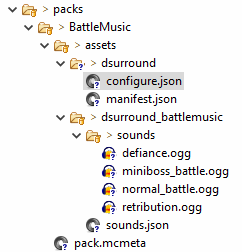

..	_tutorial-resource-packs:

Tutorial: Resource Packs
========================
The example discussed below is based on the Battle Music resource pack created for Dynamic
Surroundings.  In v3.5 the battle music assets were moved into a separate resource pack as to reduce
the size of the initial Dynamic Surroundings download size, and to serve as an example for other
resource pack makers that want to make their own battle music packs.

The resource pack layout for the Dynamic Surroundings battle music is very similar to a standard
Minecraft resource pack.  However, there are some things that are required to be in the pack so that
Dynamic Surroundings can properly integrate the resources into it's configuration.

The screenshot below shows the general layout of the pack:

As you can see in the screenshot I have a folder called packs_ in my GitHub repository where I placed
the resource pack information.  Under packs I have a folder called ``BattleMusic``.  This folder is
the root folder of the resource pack.  And under ``BattleMusic`` is the standard ``assets`` folder
that is common to all resource packs.

Under ``assets`` there is the standard ``pack.mcmeta`` file and two folders.  The contents of the
mcmeta file is pretty standard fare and information can be found on the internet as to it's content.
The two folders are covered below.

- ``dsurround``  This is a special folder that must be present in all resource packs that are to be used with Dynamic Surroundings.  Dynamic Surroundings looks for specific things in this well named folder.
- ``dsurround_battlemusic``  This is the internal name of the resource pack that Minecraft uses to identify the pack.  It must be unique between other resource packs and other mods.  Choose wisely. :)

Within ``dsurround`` are two Json files.  The names of these files are standard and must be present
for Dynamic Surroundings to use the pack.

- ``configure.json``  This Json file is just like the standard configuration Json files covered in :ref:`tutorial-config-files`.  Whatever you can do in the standard configuration files you can do in ``configure.json``.
- ``manifest.json``  The manifest file serves as a identification and credit mechanism for Dynamic Surroundings.

The content of ``manifest.json`` is as follows::

	{
		"version": 0,
		"name": "BattleMusic Resources",
		"author": "OreCruncher",
		"website": "https://minecraft.curseforge.com/projects/dynamic-surroundings"
	}
 
The "version" field must be 0.  The other fields are self explanatory.

Under ``dsurround_battlemusic`` you will find the standard ``sounds.json`` that defines the sounds
that are contained within the resource pack.  You can define entirely new sound events that are used
soley within the resource pack.  This is essentially what the battle music resource pack does.

``configuration.json`` pulls this all together.  The complete file can be found here_.  Something
worthy of pointing out is the ``soundMetadata`` section.  This section typically applies only to
resource packs.  These configuration entries provide a mechanism for attribution and credit for sound
clips used within the resource pack.  This information will be displayed in the tooltip when the
player is in the "Individual Sound Configuration" dialog of Dynamic Surroundings.

Keep in mind that a resource pack can do other thing than battle music.  It is entirely possible to
add additional biome sound tracks via a resource pack and configure biomes using the ``configure.json``.
Another possibility is to package up the external Json configuration files into a single resource
pack and distributed it via CurseForge.

..	_packs: https://github.com/OreCruncher/DynamicSurroundings/tree/master/packs
..	_here: https://github.com/OreCruncher/DynamicSurroundings/blob/master/packs/battlemusic/assets/dsurround/configure.json